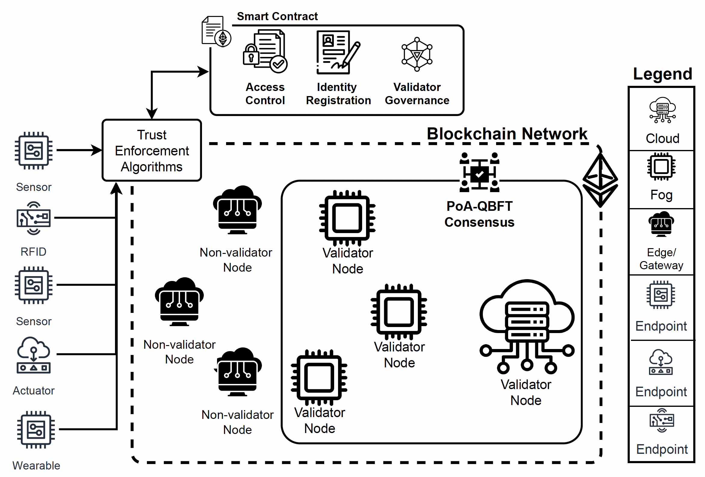

# DTEA: Distributed Trust Enforcement Architecture for Distributed IoT Infrastructure

## Overview

**DTEA** (Distributed Trust Enforcement Architecture) is a blockchain-enabled security framework designed for heterogeneous, decentralized IoT environments. It provides fine-grained access control, node registration, and role-aware consensus participation via smart contracts and capability-based tokens. The layered architecture supports localized trust enforcement, secure communication, and dynamic scalability across constrained and high-performance nodes.

---



## Key Features

- **Decentralized Trust Management**: Utilizes Hyperledger Besu (PoA-QBFT) for managing identities and enforcing smart contract logic across validator nodes.
- **Layered Security Design**:
  - **Device Layer**: Physical and virtual nodes including sensors, actuators, edge, fog, and cloud.
  - **Blockchain Layer**: Manages identity registration, access policies, and consensus state.
  - **Trust Enforcement Layer**: Governs dynamic node registration, token issuance, and validator coordination.
  - **Communication Layer**: Exposes REST APIs for secure resource interaction.
  - **Application Layer**: Handles orchestration logic and gateway control.
- **Capability Tokens**: Bidirectional, role-based access control with scoped permissions and expiry.
- **Role-Aware Deployment**: Distributes responsibilities based on node roles—Cloud/Fog (validators), Edge (non-validator), Endpoint (lightweight).

---

## Functional Phases

1. **Initialization**: Cloud node initializes blockchain, configures consensus, and deploys contracts.
2. **Node Registration**: Nodes send signed payloads for registration; verified and stored on-chain.
3. **Validator Proposal**: Validators are dynamically proposed and approved using smart contracts.
4. **Access Control**: `/read`, `/write`, `/update`, and `/remove` are authorized using capability tokens.

---

## Technology Stack

| Layer               | Tools / Technologies                            |
|--------------------|-------------------------------------------------|
| Blockchain Layer   | Hyperledger Besu, Solidity                      |
| Trust Enforcement  | Python (Flask, Web3.py), Shell scripts          |
| Communication      | RESTful APIs (Flask), Prometheus, Grafana       |
| Orchestration      | Shell-based CLI tools                           |
| Monitoring         | Prometheus Node Exporter, Python instrumentation|

---

## Metrics and Monitoring

- **Grafana UI**: [http://localhost:3000](http://localhost:3000)
- **Prometheus UI**: [http://localhost:9090](http://localhost:9090)

Launch Grafana:
```bash
cd /path/to/grafana
./bin/grafana-server web
```

Launch Prometheus:
```bash
prometheus --config.file=prometheus.yml
```

Launch Node Exporter:
```bash
cd /path/to/node_exporter
./node_exporter
```

---

## Sample Node Commands

### Cloud Node
```bash
./start_root_services.sh reinit-chain-root
./start_root_services.sh start-chain-root
./start_root_services.sh admin
./start_root_services.sh self-register CL-001 Cloudy Cloud
./start_root_services.sh read-data CL-001 Cloudy Cloud 127.0.0.1:5001
./start_root_services.sh write-data CL-001 Cloudy Cloud 127.0.0.1:5001
./start_root_services.sh remove-data CL-001 Cloudy Cloud 127.0.0.1:5001
./start_root_services.sh update-data CL-001 Cloudy Cloud 127.0.0.1:5001
```

### Fog Node
```bash
./start_client_services.sh reinit-chain-client
./start_client_services.sh register FG-001 Foggy001 Fog 127.0.0.1:5000
./start_client_services.sh read-data FG-001 Foggy001 Fog 127.0.0.1:5000
./start_client_services.sh remove-data FG-001 Foggy001 Fog 127.0.0.1:5000
./start_client_services.sh update-data FG-001 Foggy001 Fog 127.0.0.1:5000
```

---

## Device Setup 

### Prerequisites
- Ubuntu 20.04 LTS
- OpenJDK 21, Python 3.13+, Node.js 20.x

### Java
```bash
sudo apt install openjdk-21-jdk
```

### Besu Installation
```bash
curl -L https://hyperledger.jfrog.io/artifactory/besu-binaries/besu/25.1.0/besu-25.1.0.zip -o besu.zip
unzip besu.zip
sudo mv besu-25.1.0 /opt/besu
sudo ln -s /opt/besu/bin/besu /usr/local/bin/besu
```

### Python Setup (Pyenv for Pi)
```bash
curl https://pyenv.run | bash
pyenv install 3.13.2
pyenv global 3.13.2
```

### Node.js Setup (NVM)
```bash
curl -o- https://raw.githubusercontent.com/nvm-sh/nvm/v0.39.7/install.sh | bash
nvm install 20.18.3
nvm use 20.18.3
npm install web3 dotenv
```

---

## Running the System Locally
```bash
git clone https://github.com/khannmohsin/DTEA.git
cd DTEA
python3 -m venv .venv
source .venv/bin/activate
pip install -r requirements.txt
```

---

## Access Control APIs

All registered nodes expose RESTful APIs:
```http
POST /register-node
POST /read
POST /write
POST /update
POST /remove
```
Authorization is governed by on-chain capability tokens issued to valid nodes.

---

## Performance Metrics Captured
- **Execution Duration**: Per function using decorators
- **Memory Usage**: Heap memory (tracemalloc)
- **CPU Time**: User + System time (resource.getrusage)
- **Prometheus Export**: Metrics available on `/metrics` endpoint

---

## Remote Result Collection

To collect `measurements/` from distributed nodes:
```bash
scp -r <user>@<ip>:/home/<user>/DTEA/Node_client/measurements /local/path
```

---

## License
MIT License. See [LICENSE](./LICENSE).

---

## Acknowledgment
This project is developed and evaluated as part of research on distributed trust and capability-based security in IoT infrastructures. Full paper, documentation, and results are available in the repository.

